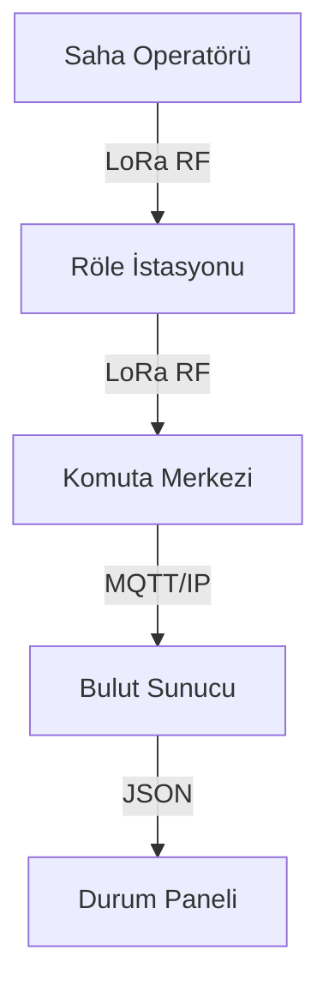

# Taktiksel Mesh Topolojisi ve Mimari

Bu belge, **Meshtastic** altyapısının "Elite Command" standartlarına göre nasıl yapılandırıldığını açıklar.

## 1. Ağ Katmanları (Network Layers)

### Katman 1: Omurga (Backbone / Repeaters)
- **Cihazlar:** Yüksek irtifaya yerleştirilmiş, güneş enerjili röleler.
- **Görev:** Geniş alan kapsama ve sinyal tekrarlama.
- **Konfigürasyon:** `CLIENT_MUTE` veya `ROUTER` modu.

### Katman 2: Saha Operatörleri (Field Operatives)
- **Cihazlar:** T-Beam, T-Echo vb. taşınabilir üniteler.
- **Görev:** Taktiksel iletişim ve GPS telemetri paylaşımı.
- **Konfigürasyon:** `CLIENT` modu, agresif güç yönetimi.

### Katman 3: Komuta Kontrol (Command & Control - C2)
- **Cihazlar:** MQTT Gateway, ATAK (Android Team Awareness Kit) entegrasyonlu tabletler.
- **Görev:** Tüm ağın izlenmesi, mesaj loglama ve stratejik yönlendirme.

## 2. LoRa Protokol Detayları
- **Frekans:** 868 MHz (EU868) - Türkiye standartlarına uygun.
- **Modülasyon:** `LongFast` (Menzil öncelikli).
- **Şifreleme:** AES-256 (Tüm kanallar şifreli).

## 3. Veri Akış Şeması

