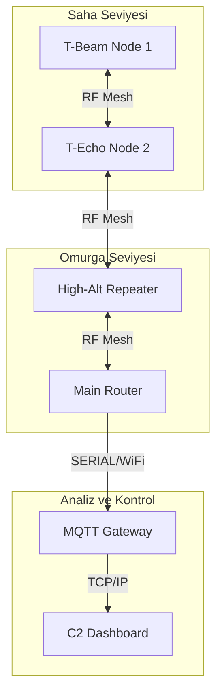

# 📡 Taktiksel Mesh Topolojisi ve Derinlemesine Mimari

Bu döküman, **Meshtastic** tabanlı bir ağın profesyonel düzeyde (Enterprise/Tactical) nasıl yapılandırılması gerektiğini, RF yayılım prensiplerini ve ağ katmanlarını detaylandırır.

---

## 🏗️ 1. Ağ Katmanı Mimarisi (Stratified Network Layers)

Ağ verimliliğini maximize etmek için cihazlar rollerine göre kategorize edilmelidir:

### A. Omurga Katmanı (Backbone - Router/Repeater)
Bu cihazlar ağın iskeletini oluşturur. Genellikle yüksek irtifada (tepeler, kuleler, bina çatıları) konumlandırılırlar.
- **Mod:** `ROUTER` veya `ROUTER_CLIENT`.
- **Donanım:** RAK4631 (Düşük güç tüketimi) + High Gain (8-10 dBi) Omni/Yagi Anten.
- **Güç:** Güneş enerjisi (Solar) + LiFePO4 batarya.
- **Amacı:** Paketi en uzak noktaya ulaştırmak, ağdaki düğümler arasında köprü kurmak.

### B. Saha Operatörleri (Field Units - Tactical)
Hareket halindeki birimler tarafından kullanılan cihazlardır.
- **Mod:** `CLIENT`.
- **Donanım:** T-Beam (GPS'li), T-Echo (E-Ink ekranlı).
- **Amacı:** Konum paylaşımı (Telemetry) ve uçtan uca şifreli mesajlaşma.
- **Önemli:** Pil ömrü için "Smart Broadcast" ayarları aktif edilmelidir.

### C. Komuta Kontrol (C2 - Gateway)
Tüm saha verisinin toplandığı ve internete/yerel ağa (LAN) aktarıldığı merkez.
- **Bağlantı:** Wi-Fi veya Ethernet üzerinden MQTT sunucusuna bağlıdır.
- **Amacı:** Veri loglama, ATAK (Android Team Awareness Kit) entegrasyonu ve stratejik analiz.

---

## 🌊 2. RF Yayılım ve Sinyal Teorisi

Mesh ağında başarının anahtarı RF planlamasıdır:

### Fresnel Bölgesi (Fresnel Zone)
İki düğüm arasında sadece "görüş hattı" (LoS) olması yetmez. Sinyalin engellenmemesi için elips şeklindeki "Fresnel Bölgesi"nin en az %60'ının boş olması gerekir.
- **İpucu:** Anten yüksekliğini her zaman artırın.

### Link Budget (Bağlantı Bütçesi)
Meshtastic cihazları genellikle -130 dBm'den daha düşük RS SI değerlerinde dahi paket çözebilir.
- **Hesaplama:** `TX Power (dBm) + Anten Kazancı (dBi) - Kablo Kaybı (dB) - Yol Kaybı (FSPL)`.

---

## 🔄 3. Mesh Yönlendirme Algoritması

Meshtastic, bir "Flooding" (Sel) algoritması kullanır ancak bu akıllıdır:
1. **Hop Limit:** Her paket bir "atlama sınırı" (varsayılan 3) ile başlar.
2. **Anti-Collision:** Cihazlar paketi tekrar iletmeden önce rastgele bir süre bekler, böylece çarpışmalar önlenir.
3. **SNR Önceliği:** Daha iyi sinyal kalitesine (SNR) sahip olan cihazların paketi iletme önceliği vardır.

---

## 📊 4. Veri Akış Modeli

---

> [!TIP]
> **Pro Tip:** Şehir içi kullanımlarda frekans kirliliğini önlemek için `LongFast` yerine `MediumFast` modunu deneyebilirsiniz, ancak menzil kısalacaktır.
